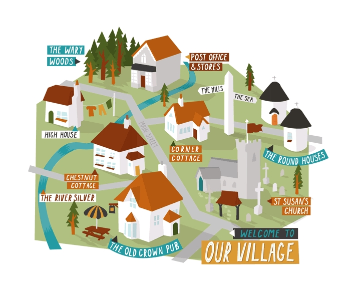

# Automaton

<p align="center">
    
</p>

> สมมติว่าเรามีโจทย์ปัญหา ในการที่จะต้องเขียนหุ่นยนต์ขึ้นมาตัวนึง เพื่อที่จะทำการรับส่งพัสดุตามสถานที่ต่างๆภายในหมู่บ้าน จากสถานที่หนึ่งไปอีกสถานที่หนึ่งจนหมด เราจะมีวิธีการเขียน หุ่นยนต์ตัวนี้ยังไงได้บ้าง

## วางแผนในการแก้ปัญหา
อย่างแรกเลยเราต้องสร้างชุดข้อมูลของถนนมาก่อนว่า ถนนเส้นไหนสามารถเดินทางไปไหนได้บ้าง เราจะเก็บข้อมูลในรูปแบบของ object ที่แต่ละ key นั้นมีค่าเป็น array ของ สถานที่ที่จะเดินทางไปได้
```
    var roads = [
        "Alice's House-Bob's House",   "Alice's House-Cabin",
        "Alice's House-Post Office",   "Bob's House-Town Hall",
        "Daria's House-Ernie's House", "Daria's House-Town Hall",
        "Ernie's House-Grete's House", "Grete's House-Farm",
        "Grete's House-Shop",          "Marketplace-Farm",
        "Marketplace-Post Office",     "Marketplace-Shop",
        "Marketplace-Town Hall",       "Shop-Town Hall"
    ];

    function buildGraph(edges) {
        let graph = Object.create(null);
        function addEdge(from, to) {
            if (graph[from] == null) {
                graph[from] = [to];
            } else {
                graph[from].push(to);
            }
            }
            for (let [from, to] of edges.map(r => r.split("-"))) {
            addEdge(from, to);
            addEdge(to, from);
        }
        return graph;
    }
    
    var roadGraph = buildGraph(roads);
```
ถ้าเรามองในแง่ของการเขียนแบบ OOP (Object-oriented programming) เราอาจจะสร้าง class ของแต่ละอันไปเลย เราอาจจะสร้าง class สำหรับ (Robot, Parcel, Places) แต่นั่นอาจจะไม่ถูกต้อง เพราะนั่นอาจจะทำให้ การที่เราจะคอย track state ของแต่ละอย่างนั้นทำได้ยากลำบาก อาจจะทำให้การเขียนโค้ดนั้น ดูยุ่งเหยิงด้วย และยากต่อการ debug

แทนที่เราจะสร้าง หลายๆ class เราสร้างขึ้นมา class เดียวที่คอยเก็บ state ของทุกอย่าง และสร้าง method move() เพื่อเคลื่อนที่ไปยังสถานที่ต่างๆ เพื่อรับและส่งพัสดุ และเช็คว่าถ้าสถานที่ ที่เดินทางไปนั้นเท่ากับจุดที่ยืนอยู่ให้ remove task อันนั้นออก
```
class VillageState {
    constructor(place, parcels) {
        this.place = place;
        this.parcels = parcels;
    }

    move(destination) {
      if (!roadGraph[this.place].includes(destination)) {
        return this;
      } else {
        let parcels = this.parcels.map(p => {
          if (p.place != this.place) return p;
          return {place: destination, address: p.address};
        }).filter(p => p.place != p.address);
        return new VillageState(destination, parcels);
      }
    }
}
```

ดูตัวอย่างการทำง่ายๆ
```
    let first = new VillageState(
        "Post Office",
        [{place: "Post Office", address: "Alice's House"}]
    );

    let next = new first.move("Alice's House");

    console.log(next.place);
    // -> Alice's House
    console.log(next.parcels);
    // -> []
    console.log(first.place);
    // -> Post Office
```

ก่อนที่เราจะเขียนการทำงานของ robot นั้น เรามาสร้าง function ในการ สุ่ม task ที่หุ่นยนต์จะต้องทำกันก่อน
```
      function randomPick(array) {
        let choice = Math.floor(Math.random() * array.length);
        return array[choice];
      }
        
      function randomRobot(state) {
        return {direction: randomPick(roadGraph[state.place])};
      }
    
      VillageState.random = function(parcelCount = 5) {
            let parcels = [];
            for (let i = 0; i < parcelCount; i++) {
                let address = randomPick(Object.keys(roadGraph));
                let place;
                do {
                    place = randomPick(Object.keys(roadGraph));
                } while (place == address);

                parcels.push({place, address});
            }
            return new VillageState("Post Office", parcels);
      };
```

สร้าง function สำหรับการ จำลองในการ run robot
```
      function runRobot(state, robot, memory) {
        for (let turn = 0;; turn++) {
            if (state.parcels.length == 0) {
                console.log(`Done in ${turn} turns`);
                break;
            }
            let action = robot(state, memory);
            state = state.move(action.direction);
            memory = action.memory;
            console.log(`Moved to ${action.direction}`);
        }
      }
```

วิธีการที่จะเลือกเส้นทางในการส่งพัสดุที่ง่ายที่สุดคือการสุ่มให้หุ่นยนต์เดินทางไปในสถานที่ต่างๆ
```
  function randomRobot(state) {
    return {direction: randomPick(roadGraph[state.place])};
  }

  runRobot(VillageState.random(), randomRobot);
```

วิธีต่อมาที่จะทำให้หุ่นยนต์ของเราทำงานได้ดีขึ้นมาอีกหน่อยนึงก็คือ ดูตัวอย่างจากการส่งของจริงๆที่บริษัทต่างๆทำกันก็คือ หาเส้นทางที่ผ่านทุกๆสถานที่ในหมู่บ้านนั้นๆ ในวิธีการนี้ หุ่นยนต์ของเราอาจจะทำการเดินทางสองรอบจากเส้นทางที่เราเลือกมา แต่มั่นใจได้แน่นอนว่างานจะเสร็จสิ้น

```
      var mailRoute = [
        "Alice's House", "Cabin", "Alice's House", "Bob's House",
        "Town Hall", "Daria's House", "Ernie's House",
        "Grete's House", "Shop", "Grete's House", "Farm",
        "Marketplace", "Post Office"
      ];

      function routeRobot(state, memory) {
            if (memory.length == 0) {
            memory = mailRoute;
            }
            return {direction: memory[0], memory: memory.slice(1)};
      }

      runRobot(VillageState.random(), routeRobot);
```

จากวิธีการข้างบนก็คือเราจะทำการเดินทางไปยังจุดต่างๆ แล้ว slice array ออกทุกครั้งจาก memory  และเดินทางไปยังตำแหน่งที่ memory[0] แต่วิธีนี้ก็อาจจะช้าเกินไปเพราะเราเดินทางไปโดยไม่ได้มีการวางแผนว่า จะต้องไปเอาของที่ไหนไปส่งที่ไหนก่อน ทำให้การเดินทางของหุ่นยนต์นั้น อาจจะต้องทำสองรอบ คือวิ่งวนรับส่งของในหมู่บ้านสองรอบ

วิธีถัดมาที่อาจจะดีขึ้นมาก็คือ Pathfinding วิธีนี้เราจะทำการค้นหาเส้นทางที่จะทำการเดินทางไปยังปลายทางโดยใช้ระยะทางที่สั้นที่สุดเสมอ และสร้างหุ่นยนต์ที่มาใช้ method findRoute นี้

```
      function findRoute(graph, from, to) {
            let work = [{at: from, route: []}];
            for (let i = 0; i < work.length; i++) {
            let {at, route} = work[i];
            for (let place of graph[at]) {
                if (place == to)  return route.concat(place);
                if (!work.some(w => w.at == place)) {
                work.push({at: place, route: route.concat(place)});
                }
            }
        }
      }

        function goalOrientedRobot({place, parcels}, route) {
            if (route.length == 0) {
            let parcel = parcels[0];
            if (parcel.place != place) {
                route = findRoute(roadGraph, place, parcel.place);
            } else {
                route = findRoute(roadGraph, place, parcel.address);
            }
        }
```

จากนั้นเราลองมาสร้าง method ในการเปรียบเทียบการทำงานของ robot กันหน่อยว่าวิธีไหนทำได้ไวกว่า

```
      function countSteps(state, robot, memory) {
            for (let steps = 0;; steps++) {
            if (state.parcels.length == 0) return steps;
            let action = robot(state, memory);
            state = state.move(action.direction);
            memory = action.memory;
            }
      }
  
    function compareRobots(robot1, memory1, robot2, memory2) {
        let total1 = 0, total2 = 0;
        for (let i = 0; i < 100; i++) {
        let state = VillageState.random();
        total1 += countSteps(state, robot1, memory1);
        total2 += countSteps(state, robot2, memory2);
        }
        console.log(`Robot 1 needed ${total1 / 100} steps per task`)
        console.log(`Robot 2 needed ${total2 / 100} steps per task`)
    }
  
    compareRobots(routeRobot, [], goalOrientedRobot, []);

    // Robot 1 needed 17.89 steps per task
    // Robot 2 needed 15.04 steps per task
```

robot ตัวที่สองได้ผลลัพธ์ที่ดีกว่า แต่ robot ตัวนี้ทำหน้าที่แค่รับของหนึ่งชิ้นไปส่งอีกที่หนึ่งเท่านั้น ถ้าเราลองเปลี่ยนเป็นรับของก่อนหลายๆชิ้น ในสถานที่ที่ใกล้ๆกันแล้วไปส่งจะไวขึ้นไหม ลองมาทำกัน

```
      function lazyRobot({place, parcels}, route) {
        if (route.length == 0) {
        // Describe a route for every parcel
        let routes = parcels.map(parcel => {
            if (parcel.place != place) {
            return {route: findRoute(roadGraph, place, parcel.place),
                    pickUp: true};
            } else {
            return {route: findRoute(roadGraph, place, parcel.address),
                    pickUp: false};
            }
        });
    
        // This determines the precedence a route gets when choosing.
        // Route length counts negatively, routes that pick up a package
        // get a small bonus.
        function score({route, pickUp}) {
            return (pickUp ? 0.5 : 0) - route.length;
        }

        route = routes.reduce((a, b) => score(a) > score(b) ? a : b).route;
        }
    
        return {direction: route[0], memory: route.slice(1)};
      }
```

lazyRobot จะทำการเช็คดูก่อนว่าสถานที่ที่จะเดินทางไปนั้น มีพัสดุที่สามารถรับได้ไหม แล้วเอามาคำนวณ score ถ้ารับพัสดุได้จะให้ score เพิ่มขึ้นมา และจะสั่งให้หุ่นยนต์นั้น เดินทางไปในจุดที่สามารถรับพัสดุได้ก่อนนั่นเอง มาลองดูผลลัพธ์เทียบกับหุ่นยนตัวเก่า

```
     compareRobots(routeRobot, [], goalOrientedRobot, [], lazyRobot, []);

     // Robot 1 needed 17.79 steps per task
     // Robot 2 needed 14.6 steps per task
     // Robot 3 needed 12.01 steps per task
```

จะเห็นได้ว่า robot ตัวที่ 3 นั้นทำงานได้ไวที่สุดในที่นี้

*ตัวอย่างทั้งหมดข้างต้น ได้ศึกษามาจากหนังสือ Eloquent Javascript