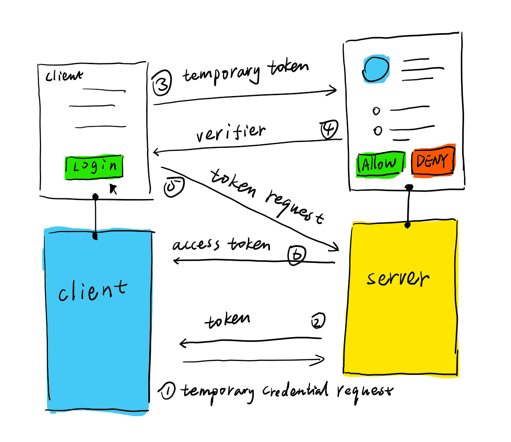

# OAuth 1.0

> OAuth provides a method for clients to access server resources on
   behalf of a resource owner (such as a different client or an end-
   user).  It also provides a process for end-users to authorize third-
   party access to their server resources without sharing their
   credentials (typically, a username and password pair), using user-
   agent redirections

    

    

OAuth 1.0 คือ Protocol ที่ใช้สำหรับการทำ Authentication และนำข้อมูลจาก Service Provider มาใช้ โดยที่ application ของเราไม่จำเป็นที่จะต้องรู้ credentials (username & password) ของ user ที่มาใช้งานผ่านระบบเรา

## Authentication Steps

1. client ยิง request เพื่อไป fetch temporaly credentials มาจาก Service provider
2. Service provider redirect กลับมาที่ application ของเรา ด้วย path callback ที่เราได้กำหนดไว้ และแนบ temporaly credentials
3. ใช้ temporaly token ยิงกลับไปที่ service provider เพื่อขอการยืนยืนในการเข้าถึง resouces ของ user 
4. Service provider หรือ server ให้ user ทำการกรอก credentials (username & password) ถ้าหากสำเร็จ redirect กลับมาที่ application ของเรา
5. ใช้ temporaly credentials และ verifier ที่ได้จากการ login และ ส่ง ไป request เพื่อขอ access token สำหรับการเข้าถึง resouces ต่างๆของ user
ุ6. ใช้ access token ที่ได้มานั้นเข้าถึงข้อมูลต่างๆของ user